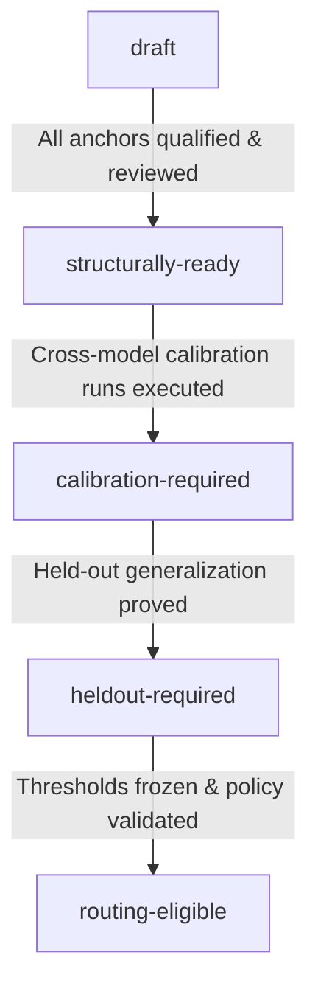

# OMP RoleBench Task Suite v1 Finalization & Freeze Specification

This document defines the structural finalization criteria for the OMP RoleBench v1 benchmark task corpus. It provides a complete task inventory across all canonical roles and task lanes, articulates machine-auditable freeze requirements, resolves role and lane ownership, and establishes the lifecycle from structural readiness to statistical routing eligibility.

---

## 1. Corpus Architecture & Philosophy

OMP RoleBench measures exact candidate model routes against the canonical workload requirements of [Oh My Pi](https://github.com/can1357/oh-my-pi). To produce fair, reproducible, and allocation-effective recommendations:

1. **Roles, Not Generic Leaderboards:** Every task measures direct competence against a specific native OMP role contract (`@default`, `@plan`, `@reviewer`, `@advisor`, `@task`, `@slow`, `@vision`, `@designer`, `@commit`, `@tiny`, `@smol`).
2. **Workload Lanes for Autonomous Execution:** The `@task` role is further specialized across six routing lanes (`task/implementation`, `task/debugging`, `task/test-repair`, `task/refactor`, `task/repo-research`, `task/mechanical-edit`). A lane earns distinct route weights only when direct evidence shows that specialization reduces held-out allocation regret.
3. **Direct Measurement vs. Proxy Competence:** Adjacent competence (e.g. passing a generic Python quiz) does not qualify a route for an OMP role. Tasks must exercise the native workflow, constraints, tools, and output contracts of that role.
4. **Structural Completeness vs. Statistical Readiness:** A task suite is *structurally complete* when all role and lane capability cells are populated with qualified, isolated, and reviewed anchors. It remains *routing-ineligible* until cross-model discrimination evidence and family-disjoint held-out runs prove generalization.

---

## 2. Complete Task Suite Inventory

The table below catalogs every calibration anchor in the v1 profile (14 existing anchors across 10 initial packs, plus two direct OMP-native anchors for the `reviewer` role pack).

| Anchor ID | Role | Optional Lane | Source & Version | Kind | Capability Focus | Difficulty | Work Shape | Verifier Kind |
|---|---|---|---|---|---|---|---|---|
| `terminal-bench.sanitize-git-repo` | `default` | — | Terminal-Bench 2.1-r6 | Public / Calibration | `repo-cleanup`, `git-tooling` | Medium | Mutation (Git repo) | Executable repo verifier |
| `terminal-bench.multi-source-data-merger` | `default` | — | Terminal-Bench 2.1-r6 | Public / Calibration | `data-pipeline`, `multi-source` | Medium | Mutation (Python script) | Executable data validator |
| `terminal-bench.cancel-async-tasks` | `task` | `task/debugging` | Terminal-Bench 2.1-r6 | Public / Calibration | `asyncio`, `task-cancellation` | Medium | Mutation (Asyncio lib) | Executable test suite |
| `terminal-bench.custom-memory-heap-crash` | `slow` | — | Terminal-Bench 2.1-r6 | Public / Calibration | `deep-reasoning`, `memory-crash` | Hard | Mutation (C memory manager) | Executable crash verifier |
| `terminal-bench.db-wal-recovery` | `slow` | — | Terminal-Bench 2.1-r6 | Public / Calibration | `wal-recovery`, `database-engine` | Hard | Mutation (WAL parser) | Executable recovery suite |
| `terminal-bench.llm-inference-batching-scheduler` | `plan` | — | Terminal-Bench 2.1-r6 | Public / Calibration | `architecture`, `scheduler-design` | Medium | Mutation (Scheduler architecture) | Executable simulation verifier |
| `terminal-bench.fix-code-vulnerability` | `advisor` | — | Terminal-Bench 2.1-r6 | Public / Calibration | `vulnerability-patching`, `security` | Medium | Mutation (C vulnerability fix) | Executable security verifier |
| `terminal-bench.memcached-backdoor` | `advisor` | — | Terminal-Bench 3.0-r1 | Public / Calibration | `backdoor-detection`, `exploit-analysis` | Hard | Read-only + Proof | Executable exploit verifier |
| `terminal-bench.large-scale-text-editing` | `smol` | — | Terminal-Bench 2.1-r6 | Public / Calibration | `bounded-editing`, `vim-macros` | Easy | Bounded Mutation | Deterministic output check |
| `terminal-bench.code-from-image` | `vision` | — | Terminal-Bench 2.1-r6 | Public / Calibration | `image-to-code`, `ocr-layout` | Easy | Image Synthesis | Executable code validator |
| `terminal-bench.cad-model` | `vision` | — | Terminal-Bench 3.0-r1 | Public / Calibration | `cad-dimension-extraction` | Medium | Image Feature Graph | Deterministic feature graph |
| `omp-native.metadata-normalization` | `tiny` | — | OMP-Native 1.0.0 | Public / Calibration | `normalization`, `exact-json` | Easy | Extraction (JSON) | Deterministic equality |
| `omp-native.diff-commit-message` | `commit` | — | OMP-Native 1.0.0 | Public / Calibration | `diff-summary`, `evidence-citation` | Easy | Text Synthesis | Grammar & citation grammar |
| `omp-native.responsive-incident-console` | `designer` | — | OMP-Native 1.0.0 | Public / Calibration | `css-grid`, `wcag-aa`, `contrast` | Medium | Rendered HTML/CSS | Headless Chromium DOM audit |
| `omp-native.code-review-defect-recall` | `reviewer` | — | OMP-Native 1.0.0 | Public / Calibration | `defect-recall`, `structured-findings` | Medium | Read-only Diff Review | Structured finding validator |
| `omp-native.code-review-precision-control` | `reviewer` | — | OMP-Native 1.0.0 | Public / Calibration | `false-positive-control`, `precision` | Medium | Read-only Clean Review | False-positive penalty audit |

### Detailed Anchor Diagnostics & Gaming Risks

1. **`default-v1` (`sanitize-git-repo`, `multi-source-data-merger`)**: Directly measures interactive terminal navigation, multi-file inspection, and tool execution. Floor risk: low; Ceiling risk: moderate on modern frontier models. Gaming surface: minimal due to executable integration tests.
2. **`task-v1` (`cancel-async-tasks`)**: Measures delegated debugging and concurrency repair. Structural limitation: currently only covers the `task/debugging` lane; lacks anchors for `implementation`, `test-repair`, `refactor`, `repo-research`, and `mechanical-edit`.
3. **`slow-v1` (`custom-memory-heap-crash`, `db-wal-recovery`)**: High difficulty, multi-step reasoning, memory forensics, and database state recovery. High floor discrimination.
4. **`vision-v1` (`code-from-image`, `cad-model`)**: Measures visual coding and mechanical dimension extraction. Verifiers enforce exact normalized coordinate and feature extraction.
5. **`plan-v1` (`llm-inference-batching-scheduler`)**: Measures architectural decomposition and scheduling algorithms.
6. **`designer-v1` (`responsive-incident-console`)**: OMP-native rendered UI audit. Tests computed styles, contrast ratios (WCAG AA), responsive media queries, and keyboard focus indicators via headless Chromium.
7. **`commit-v1` (`diff-commit-message`)**: Diff comprehension, conventional commit structure, exact citation of modified lines, and zero hallucination.
8. **`tiny-v1` (`metadata-normalization`)**: Low-latency structured classification and JSON normalization.
9. **`advisor-v1` (`fix-code-vulnerability`, `memcached-backdoor`)**: Measures security defect discovery and remediation.
10. **`reviewer-v1` (`code-review-defect-recall`, `code-review-precision-control`)**: Directly tests structured code review findings, line citations, defect severity calibration, and false-positive suppression on clean code.

---

## 3. V1 Task Suite Freeze Criteria

The machine-readable specification `contracts/task-suite-profile-v1.json` governs when the task suite may transition to `structurally-ready` and subsequently `frozen`.

### Criterion 1: Direct Role Coverage (11 Roles)
Every role must possess at least the required minimum number of direct calibration anchors:
- `default`: $\ge 2$ anchors
- `smol`: $\ge 1$ anchor
- `slow`: $\ge 2$ anchors
- `vision`: $\ge 2$ anchors
- `plan`: $\ge 1$ anchor
- `designer`: $\ge 1$ anchor
- `commit`: $\ge 1$ anchor
- `tiny`: $\ge 1$ anchor
- `task`: $\ge 1$ anchor (generic)
- `advisor`: $\ge 2$ anchors
- `reviewer`: $\ge 2$ anchors (1 recall + 1 precision)

### Criterion 2: Task Lane Coverage (6 Lanes)
For the `@task` role, each active routing lane requires direct anchors before specialized allocation weights may be published:
- `task/implementation`: $\ge 2$ anchors
- `task/debugging`: $\ge 2$ anchors (1 currently populated)
- `task/test-repair`: $\ge 2$ anchors
- `task/refactor`: $\ge 2$ anchors
- `task/repo-research`: $\ge 2$ anchors
- `task/mechanical-edit`: $\ge 2$ anchors

### Criterion 3: Capability Coverage Matrix
Every capability declared in a role contract or task lane definition must be exercised by at least one qualified anchor in that pack.

### Criterion 4: Verifier Quality & Isolation Standards
All verifiers must satisfy the fail-closed security boundary:
- **No Untrusted Execution:** Verifier containers must never execute unreviewed candidate code. Candidate code runs strictly in the isolated candidate runner.
- **Passive Evidence Envelope:** Verifiers parse inert structured evidence envelopes and verify test outcomes or diffs.
- **Tamper Resistance:** Every anchor must include baseline and tamper probes that fail qualification if the verifier accepts negative or fabricated outputs.
- **No Leaked Holdouts:** Verification logic must not leak private assertions or solutions to the candidate prompt or runtime.

### Criterion 5: Family-Disjoint Split Policy
- Anchor tasks and held-out evaluation tasks must be partitioned at the **task family** level.
- Near-duplicate variations (e.g. variations on the same repository bug) must never appear simultaneously in calibration and hold-out sets.

---

## 4. Readiness Lifecycle

1. **`draft`**: Tasks, packs, or qualifications are incomplete or undergoing authoring.
2. **`structurally-ready`**: All role and lane capability cells are populated with qualified anchors, valid split reviews, and isolated passive verifiers.
3. **`calibration-required`**: Structurally complete suite awaiting multi-model calibration evidence across candidate routes.
4. **`heldout-required`**: Calibration complete; awaiting family-disjoint held-out evaluation to verify allocation regret reduction.
5. **`routing-eligible`**: Full calibration and held-out validation complete; thresholds frozen; authorized for production OMP routing policy generation.

---

## 5. Summary of Audit Machinery

The CLI command `rolebench tasks suite-audit [--json] [--strict]` implements automated verification of these criteria against the live repository state. It evaluates role coverage, lane binding, capability completeness, and split reviews, emitting stable machine-readable reason codes when structural gaps are encountered.
