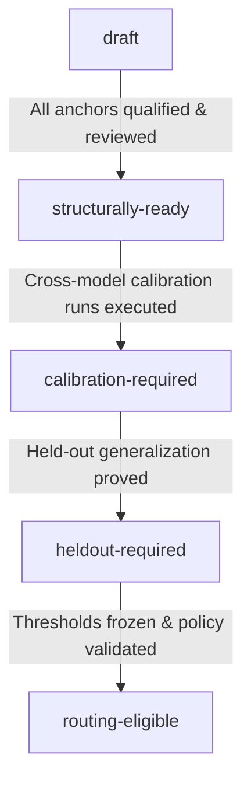

# OMP RoleBench Task Suite v1 Finalization & Freeze Specification

This document defines the structural finalization criteria for the OMP RoleBench v1 benchmark task corpus. It provides a complete task inventory across all 11 canonical roles and 6 `@task` routing lanes, articulates machine-auditable freeze requirements, resolves role and lane ownership, and establishes the lifecycle from structural readiness to statistical routing eligibility.

---

## 1. Corpus Architecture & Philosophy

OMP RoleBench measures exact candidate model routes against the canonical workload requirements of [Oh My Pi](https://github.com/can1357/oh-my-pi). To produce fair, reproducible, and allocation-effective recommendations:

1. **Roles, Not Generic Leaderboards:** Every task measures direct competence against a specific native OMP role contract (`@default`, `@plan`, `@reviewer`, `@advisor`, `@task`, `@slow`, `@vision`, `@designer`, `@commit`, `@tiny`, `@smol`).
2. **Workload Lanes for Autonomous Execution:** The `@task` role is further specialized across six routing lanes (`task/implementation`, `task/debugging`, `task/test-repair`, `task/refactor`, `task/repo-research`, `task/mechanical-edit`). A lane earns distinct route weights only when direct evidence shows that specialization reduces held-out allocation regret.
3. **Direct Measurement vs. Proxy Competence:** Adjacent competence does not qualify a route for an OMP role. Tasks must exercise the native workflow, constraints, tools, and output contracts of that role.
4. **Structural Completeness vs. Statistical Readiness:** A task suite is *structurally complete* when all role and lane capability cells are populated with qualified, isolated, and reviewed anchors. It remains *routing-ineligible* until cross-model discrimination evidence and family-disjoint held-out runs prove generalization.

---

## 2. Complete Task Suite Inventory (27 Anchors)

The table below catalogs every calibration anchor in the v1 profile across all 11 roles and 6 `@task` routing lanes.

| Anchor ID | Role | Optional Lane | Source & Version | Kind | Capability Focus | Difficulty | Work Shape | Verifier Kind |
|---|---|---|---|---|---|---|---|---|
| `terminal-bench.sanitize-git-repo` | `default` | — | Terminal-Bench 2.1-r6 | Public / Calibration | `repo-cleanup`, `git-tooling` | Medium | Mutation (Git repo) | Executable repo verifier |
| `terminal-bench.multi-source-data-merger` | `default` | — | Terminal-Bench 2.1-r6 | Public / Calibration | `data-pipeline`, `multi-source` | Medium | Mutation (Python script) | Executable data validator |
| `terminal-bench.cancel-async-tasks` | `task` | `task/debugging` | Terminal-Bench 2.1-r6 | Public / Calibration | `asyncio`, `task-cancellation` | Medium | Mutation (Asyncio lib) | Executable test suite |
| `omp-native.distributed-lease-deadlock` | `task` | `task/debugging` | OMP-Native 1.0.0 | Public / Calibration | `lease-deadlock`, `distributed-state` | Hard | Mutation (Distributed lock) | Executable stress verifier |
| `omp-native.event-stream-multiplexer` | `task` | `task/implementation` | OMP-Native 1.0.0 | Public / Calibration | `async-pubsub`, `backpressure` | Medium | Implementation (Event bus) | Executable test suite |
| `omp-native.feature-matrix-compiler` | `task` | `task/implementation` | OMP-Native 1.0.0 | Public / Calibration | `aggregation-compiler`, `typing` | Medium | Implementation (Compiler CLI) | Executable test suite |
| `omp-native.api-contract-test-modernization` | `task` | `task/test-repair` | OMP-Native 1.0.0 | Public / Calibration | `mock-fixtures`, `contract-tests` | Medium | Test Repair (API tests) | Mutation test verifier |
| `omp-native.pytest-fixture-migration` | `task` | `task/test-repair` | OMP-Native 1.0.0 | Public / Calibration | `unittest-to-pytest`, `fixtures` | Medium | Test Repair (Pytest suite) | Executable test suite |
| `omp-native.sync-to-async-client-refactor` | `task` | `task/refactor` | OMP-Native 1.0.0 | Public / Calibration | `sync-to-async`, `callsite-migration` | Hard | Refactoring (Client modules) | AST & integration verifier |
| `omp-native.modernize-scientific-stack` | `task` | `task/refactor` | OMP-Native 1.0.0 | Public / Calibration | `numpy-matrix-modernization` | Medium | Refactoring (Scientific stack) | Numerical equality verifier |
| `omp-native.architecture-dependency-audit` | `task` | `task/repo-research` | OMP-Native 1.0.0 | Public / Calibration | `dependency-mapping`, `call-graphs` | Medium | Read-only Exploration | JSON graph equality |
| `omp-native.vulnerability-impact-trace` | `task` | `task/repo-research` | OMP-Native 1.0.0 | Public / Calibration | `source-to-sink-tracing` | Medium | Read-only Exploration | JSON dataflow equality |
| `omp-native.schema-enum-sync` | `task` | `task/mechanical-edit` | OMP-Native 1.0.0 | Public / Calibration | `batch-enum-updates`, `typing` | Medium | Batch Mutation (20 models) | AST exhaustive validator |
| `omp-native.deprecation-annotation-pass` | `task` | `task/mechanical-edit` | OMP-Native 1.0.0 | Public / Calibration | `deprecation-decorators`, `docs` | Medium | Batch Mutation (25 exports) | AST exhaustive validator |
| `terminal-bench.custom-memory-heap-crash` | `slow` | — | Terminal-Bench 2.1-r6 | Public / Calibration | `deep-reasoning`, `memory-crash` | Hard | Mutation (C memory manager) | Executable crash verifier |
| `terminal-bench.db-wal-recovery` | `slow` | — | Terminal-Bench 2.1-r6 | Public / Calibration | `wal-recovery`, `database-engine` | Hard | Mutation (WAL parser) | Executable recovery suite |
| `terminal-bench.llm-inference-batching-scheduler` | `plan` | — | Terminal-Bench 2.1-r6 | Public / Calibration | `architecture`, `scheduler-design` | Medium | Mutation (Scheduler architecture) | Executable simulation verifier |
| `terminal-bench.fix-code-vulnerability` | `advisor` | — | Terminal-Bench 2.1-r6 | Public / Calibration | `vulnerability-patching`, `security` | Medium | Mutation (C vulnerability fix) | Executable security verifier |
| `terminal-bench.memcached-backdoor` | `advisor` | — | Terminal-Bench 3.0-r1 | Public / Calibration | `backdoor-detection`, `exploit-analysis` | Hard | Read-only + Proof | Executable exploit verifier |
| `terminal-bench.large-scale-text-editing` | `smol` | — | Terminal-Bench 2.1-r6 | Public / Calibration | `bounded-editing`, `vim-macros` | Easy | Bounded Mutation | Deterministic output check |
| `terminal-bench.code-from-image` | `vision` | — | Terminal-Bench 2.1-r6 | Public / Calibration | `image-to-code`, `ocr-layout` | Easy | Image Synthesis | Executable code validator |
| `terminal-bench.cad-model` | `vision` | — | Terminal-Bench 3.0-r1 | Public / Calibration | `cad-dimension-extraction` | Medium | Image Feature Graph | Deterministic feature graph |
| `omp-native.metadata-normalization` | `tiny` | — | OMP-Native 1.0.0 | Public / Calibration | `normalization`, `exact-json` | Easy | Extraction (JSON) | Deterministic equality |
| `omp-native.diff-commit-message` | `commit` | — | OMP-Native 1.0.0 | Public / Calibration | `diff-summary`, `evidence-citation` | Easy | Text Synthesis | Grammar & citation grammar |
| `omp-native.responsive-incident-console` | `designer` | — | OMP-Native 1.0.0 | Public / Calibration | `css-grid`, `wcag-aa`, `contrast` | Medium | Rendered HTML/CSS | Headless Chromium DOM audit |
| `omp-native.code-review-defect-recall` | `reviewer` | — | OMP-Native 1.0.0 | Public / Calibration | `defect-recall`, `structured-findings` | Medium | Read-only Diff Review | Structured finding validator |
| `omp-native.code-review-precision-control` | `reviewer` | — | OMP-Native 1.0.0 | Public / Calibration | `false-positive-control`, `precision` | Medium | Read-only Clean Review | False-positive penalty audit |

---

## 3. V1 Task Suite Freeze Criteria

The machine-readable specification `contracts/task-suite-profile-v1.json` governs structural freeze:

### Criterion 1: Direct Role Coverage (11/11 Roles Satisfied)
All 11 canonical roles meet or exceed their minimum required anchor count.

### Criterion 2: Task Lane Coverage (6/6 Lanes Satisfied)
All 6 `@task` routing lanes have $\ge 2$ qualified anchors covering all declared lane capabilities.

### Criterion 3: Capability Coverage Matrix (100% Coverage)
Every capability declared in role contracts and lane specifications is exercised by qualified anchors.

### Criterion 4: Verifier Quality & Isolation Standards
- Verifier containers never execute unreviewed candidate code.
- Verifiers operate on passive framed evidence envelopes.
- Tamper resistance proven by baseline and tamper probe rejections during qualification.

### Criterion 5: Family-Disjoint Split Policy
Anchor tasks and held-out evaluation tasks are partitioned at the task-family level.

---

## 4. Readiness Lifecycle

Current State: **`structurally-ready`** (passed via `rolebench tasks suite-audit --strict`).
All packs remain **`calibration-only`** and **`routing-ineligible`** pending operator-selected model calibration runs.
